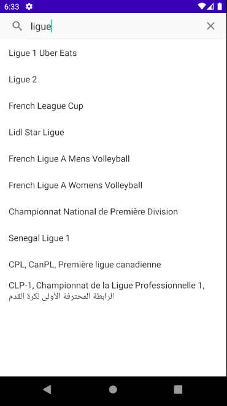
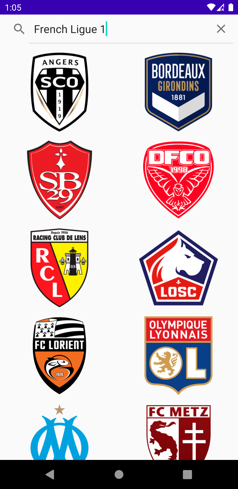
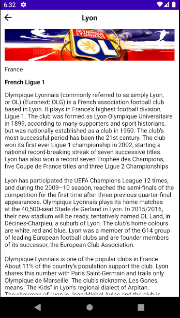

# testFDJ
Ce projet utilise l'API SportDB pour rechercher une ligue de football, afficher la liste des équipes la composant ainsi que le détail de chacune de ces équipes

# Stack technique
Kotlin, coroutine, Dagger 2, Retrofit, Glide, JUnit, Mockito

# Le projet
Il a été développé suivant l'architecture MVP. Voici comment le projet est organisé:

Search -> package global, pourrait être un module sur un projet professionnel, accompagné d'autres modules représentant les autres features de l'appli
 - injection -> module + component nécessaires pour l'injection de dépendance
 - home -> fragment + presenter + interfaces pour la recherche de ligues et afficher la liste des équipes
 - detail  -> fragment + presenter + interfaces pour afficher les détails d'une équipe en particulier
 - model -> les représentations des ligues et équipes
 - data -> API + repository pour les appels réseaux
 
 Une autre manière de faire aurait été de suivre la Clean Archi en se basant sur ce modèle:
 Search
 - injection -> module et component pour dagger
 - data -> le repository et api pour appels réseaux
 - domain -> les uses cases, interface de repository et models
 - presentation -> les presenter, fragment et interfaces des différents écrans
   - home
   - detail
 
 L'auto complétion a été basée sur le name et sur l'alternate name pour laissée plus de possibilités à l'utilisateur
 
 # Les tests
 J'ai créé plusieurs tests sur les presenters pour tester le bon fonctionnement de transmissions des informations. 
 Tous les cas n'ont pas été testés volontairement pour des questions de timing. Les tests ont été créés à posteriori, une autre méthode comme de la TDD peut être envisagée.
 
 # L'UI
 J'ai utilisé les constraint layout pour créer les écrans. 
 J'ai laissé les chaines de caractères et les éléments graphiques (margin, color, etc..) en dur, sur un vrai projet il faudrait créer des styles et string dans les fichiers correspondants.
 Toujours pour des questions de timing, je n'ai aucun élément graphique au cas où les informations sont mal récupérées ou si elles sont vides
 
 # Screenshots
 
 
 
